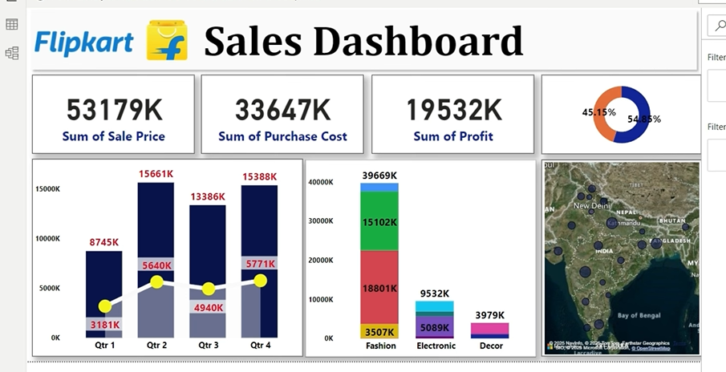
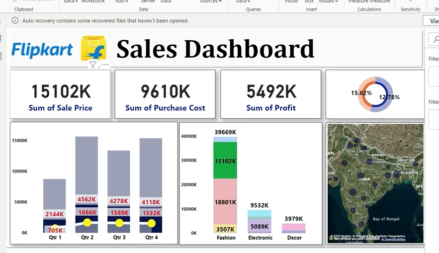

# Flipkart-Sales-Dashboard---Power-BI
This Power BI project focuses on analyzing **Flipkart's sales performance.
# 📊 Flipkart Sales Dashboard – Power BI Project
## 🧠 Project Overview
This Power BI project focuses on analyzing **Flipkart's sales performance** across different quarters and product categories.  
The goal of this dashboard is to visualize business insights and support data-driven decision-making.

---

## 🎯 Objectives
- To analyze **Total Sales, Purchase Cost, and Profit**.
- To compare **Quarterly Performance** visually.
- To understand **Category-wise Sales** (Fashion, Electronic, Decor).
- To identify **Regional Performance Trends** using map visuals.

---

## 📈 Key Insights
- Total **Sales:** 53,179K  
- Total **Purchase Cost:** 33,647K  
- Total **Profit:** 19,532K  
- Highest sales recorded in **Q2** (15,661K).  
- **Fashion** category contributes the most to overall sales.

---

## 🧩 Tools Used
- **Microsoft Power BI**
- **Excel / CSV Dataset**
- **DAX Measures**
- **Data Cleaning & Modeling**

---

## 🗂️ Dashboard Features
- KPI cards for **Sales, Cost, and Profit**
- **Quarterly Trend Analysis** using bar & line chart
- **Category-wise Breakdown** (Stacked Column)
- **Geographical Visualization** (Map of India)
- **Interactive Filters** for better insights

## 📊 Business Impact
This dashboard provides a clear overview of sales performance, helping stakeholders:
- Track quarterly growth
- Identify top-performing regions
- Optimize inventory and pricing strategies
